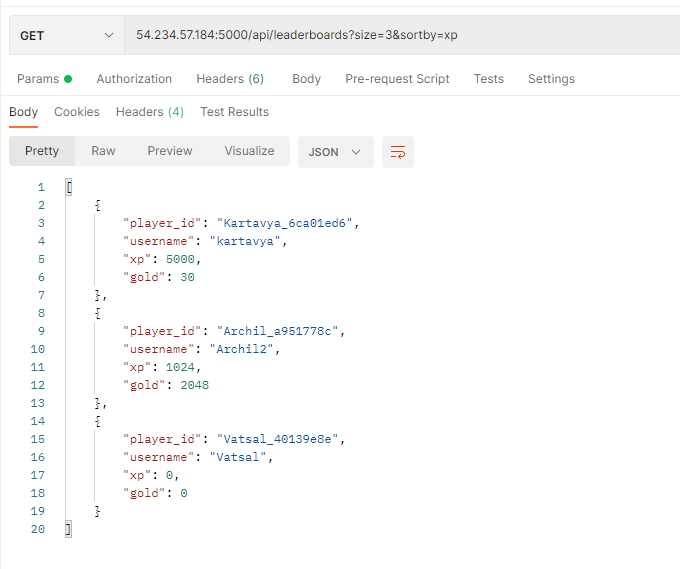

# Dots-Take-Home-Assignment

Here is a a prototype API using a microservices architecture to support various game functionalities.

### Web server

54.234.57.184:5000

## Tools & Technologies Used

1. Amazon EC2 - To host the backend
2. ElasticSearch Service - to store and catch data
3. Flask - Web framework
4. Docker - To containerize application
5. Postman - to test functionalities of backend

## System Design

## Example

## Steps to run

- To start, first we have to build a docker container.
- In the main project folder - "Dots-Assignment/" run the command "docker-compose build", this would build a docker image.
- Run the docker image using "docker-compose up".
- The ElasticSearch Service is already running so no further steps are required.
- The server would be listening for HTTP requests on port 5000. I have hosted a server on an EC2 instance available at 54.234.57.184. So, the address to send requests would be - "54.234.57.184:5000"
